# Settings 源码开发说明

## 1. 项目介绍
Settings是基于 OpenHarmony 平台开发的基于OHOS提供基础设置功能。主要包括页面展示跳转逻辑、基础设置项(wifi设置、亮度设置、应用管理、日期和时间、关于手机)以及本设备其他应用设置项的收集、其他设备设置项收集的实现。项目采用MVVM架构模式，让各个层级之间不直接访问减少相互依赖。

Settings采用纯 ETS 语言开发，开发过程中不涉及任何 Java 部分的代码。

## 2. 工程结构
### 目录结构  

    /applications/standard/settings
    ├── entry             # 主entry模块目录
    │   └── src
    │       ├── main
    │           ├── ets               # ets模块目录
    │               ├── default
    │                   ├── common    # 公共工具存放目录
    │                   ├── model     # 数据管理和决策逻辑存放目录
    │                   ├── pages     # 组件页面存放目录
    │                   ├── res       # 部分图片资源
    │                   ├── resources # 其它共用资源
    │                   ├── app.ets   # 全局ets逻辑和应用生命周期管理文件
    │           ├── resources         # 资源配置文件存放目录
    │               ├── base          # 默认语言场景，图片资源，字体大小，颜色资源内容存放目录
    │               ├── en_AS.element # 英文语言场景资源内容存放目录
    │               ├── rawfile       # 本地配置文件存放目录
    │               ├── zh_CN.element # 中文语言场景资源内容存放目录
    │           └── config.json       # 全局配置文件
    ├── signature          # 证书文件目录
    ├── LICENSE            # 许可文件

### 整体架构


设置 整体是 openHarmony 系统中预置的系统应用，为用户提供设置系统属性的交互界面。例如设置wifi状态，系统时间，屏幕亮度等系统属性。

Settings整体采用MVVM架构设计。关于MVVM架构中各层级的描述如下：

View：视图层，负责界面数据的展示，与用户进行交互。 

ViewModel：视图模型，用UI Component将公用逻辑抽离，建立一套公用的ui引擎处理视图层（View）发送的业务逻辑处理请求，并连通 Model 层获取数据。

Model：模型层，负责处理数据，包括wifi的model，应用管理model，日期时间model等。

## 3. 代码使用
### 代码下载
基于L2的 Settings代码可以采用从码云上克隆的方式下载。  
[下载地址](https://gitee.com/openharmony/applications_settings)

#### 从码云克隆代码
##### 1.配置SSH公钥
1. 通过[登录网址](https://gitee.com/login)登录码云
2. 在码云的个人设置中设置SSH公钥
   1. 生成SSH公私钥  
   在命令窗口输入以下命令，邮箱地址替换为自己的邮箱地址，一直回车直至完成为止。
    ```
    ssh-keygen -t rsa -C "xxxx@xxxx.com"
    ```
    > 执行完成后，会在用户目录下的.ssh文件夹内生成 `id_rsa` 与 `id_rsa.pub` 两个文件，其中的 `id_rsa.pub` 即为生成的 SSH公钥  
    >
    > 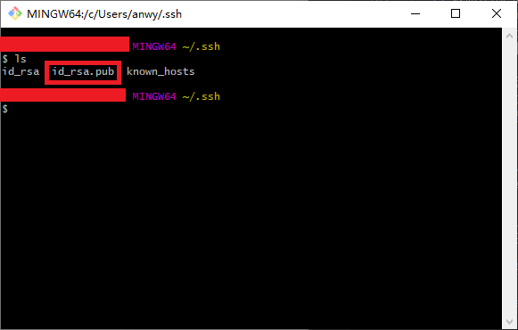
    >
    > 2. 复制公钥内容  
    > 输入`cat .ssh/id_rsa.pub`，复制打印内容。
    > 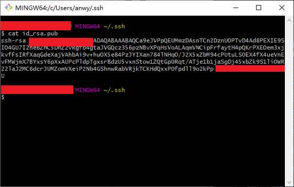
    > 3. 在设置->安全设置->SSH公钥 中设置 SSH公钥  
    > 将第二步中复制的内容按照画面提示粘贴到码云上相应的内容区域，并点击确定。
    > 
    > 注意，在码云中，添加SSH公钥之后，需要进行账号的密码验证，验证通过才能成功添加。
##### 2.下载代码
1. 浏览器打开[下载地址](https://gitee.com/openharmony/applications_settings)。
2. 点击“克隆/下载”按钮，选择 SSH，点击“复制”按钮。
   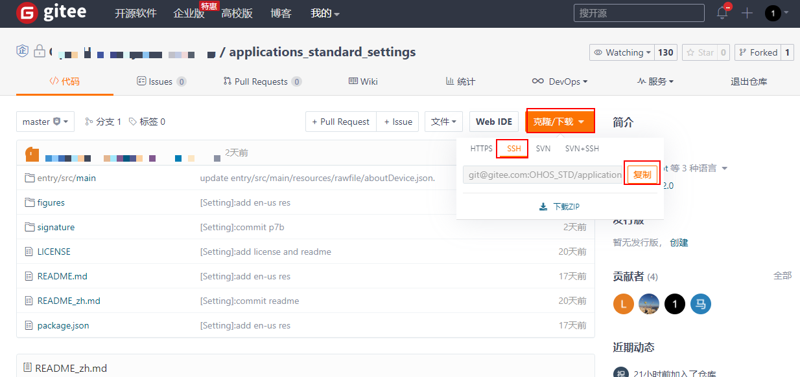
3. 在本地新建 Settings 目录，在 Settings 目录中执行如下命令
   ```
   git clone 步骤2中复制的地址
   ```
### 环境搭建
#### 1. 下载安装 DevEco Studio
Settings使用 DevEco Studio 进行开发，开发前需要下载 DevEco Studio 。  

**1）下载**  

在下载页面下载 DevEco Studio 的安装包压缩文件（[下载地址](https://developer.harmonyos.com/cn/develop/deveco-studio#download)）。
下载页面如下：

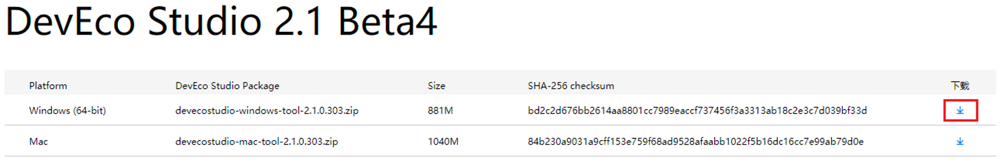

> 注：下载 DevEco Studio 需要注册华为账号。
> 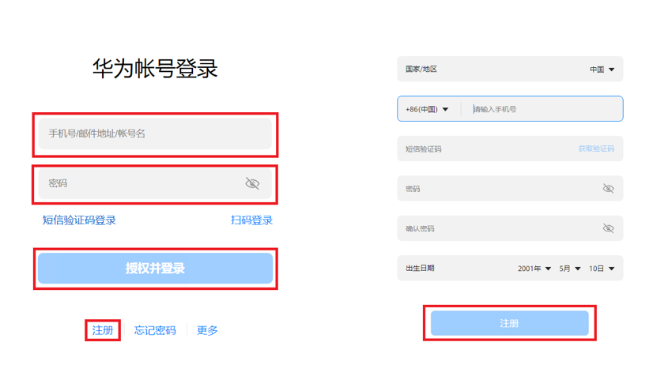

**2）安装**

将下载下来的压缩包解压，得到安装文件如图：


双击安装文件进行安装，安装过程如图所示：

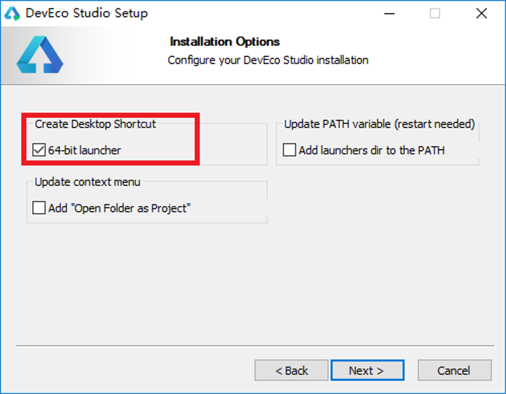

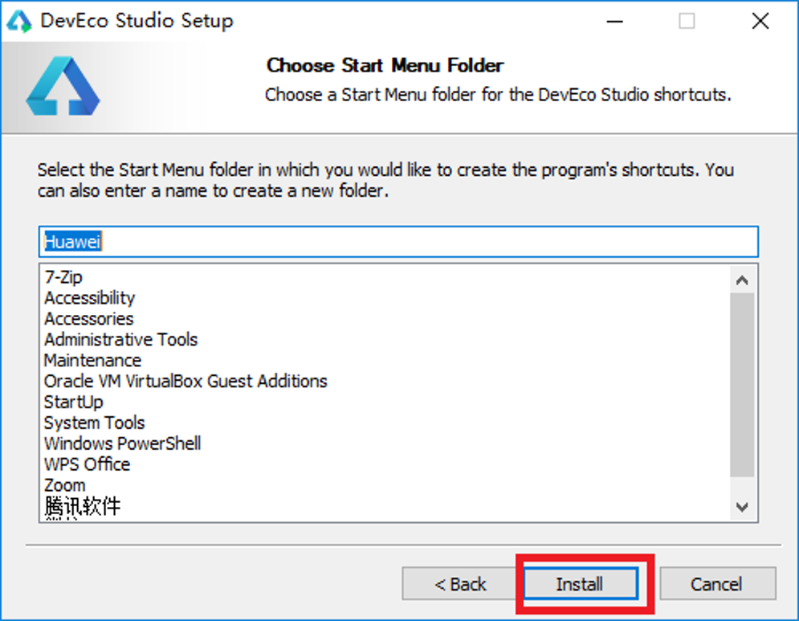

#### 2. 安装开发 SDK
DevEco Studio 在安装完成之后会自动下载开发 SDK 下载过程如下图所示：

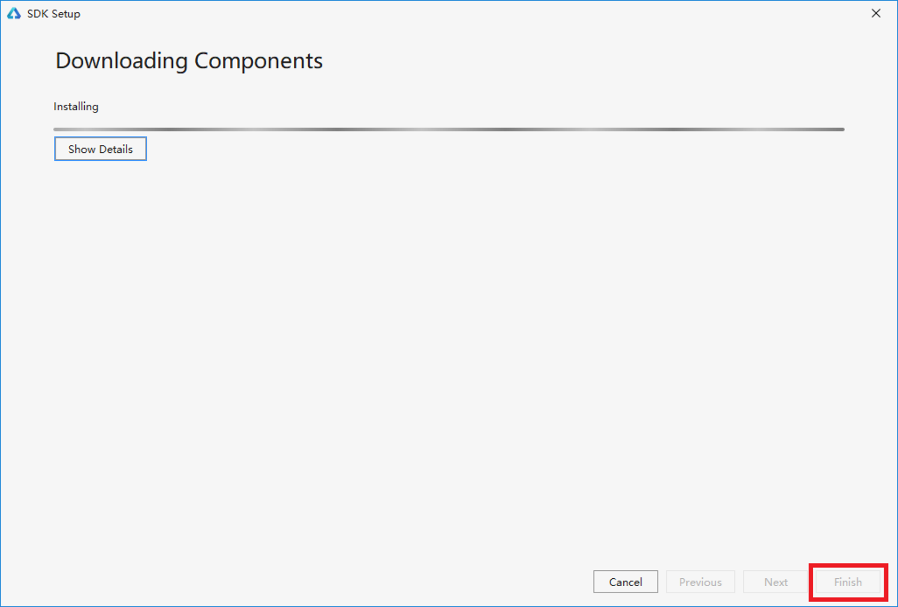 

### 工程导入 DevEco Studio

> 由于 Settings 的开源代码中删除了工程中的 `build.gradle` 文件，所以我们需要在相应的目录创建 `build.gradle` 文件以保证工程可以被正确导入 DevEco Studio 。  

#### 1. 为 Settings工程添加 `build.gradle` 

1. 在工程根目录下，添加 build.gradle 文件，内容如下：

```
apply plugin: 'com.huawei.ohos.app'

ohos {
    compileSdkVersion 7
    defaultConfig {
        compatibleSdkVersion 6
    }
    supportSystem "standard"
}

buildscript {
    repositories {
        maven {
            url 'http://repo.ark.tools.huawei.com/artifactory/maven-public/'
        }
        maven {
            url 'https://mirrors.huaweicloud.com/repository/maven/'
        }
        maven {
            url 'https://developer.huawei.com/repo/'
        }
        jcenter()
    }
    dependencies {
        classpath 'com.huawei.ohos:hap:3.0.3.2'
    }
}

allprojects {
    repositories {
        maven {
            url 'http://repo.ark.tools.huawei.com/artifactory/maven-public/'
        }
        maven {
            url 'https://mirrors.huaweicloud.com/repository/maven/'
        }
        maven {
            url 'https://developer.huawei.com/repo/'
        }
        jcenter()
    }
}
```

2. 在工程的 entry 目录下，添加 build.gradle 文件，内容如下：

```
apply plugin: 'com.huawei.ohos.hap'
ohos {
    compileSdkVersion 7
    defaultConfig {
        compatibleSdkVersion 6
    }
    arkEnabled false
}

dependencies {
    implementation fileTree(dir: 'libs', include: ['*.jar', '*.har'])
    testCompile 'junit:junit:4.12'
}
```

#### 2. build Settings 工程

在添加完上面三个 build.gradle 文件后，DevEco Studio 可以正常导入工程。

选择Build → Build Haps(s)/APP(s) → Build Hap(s)

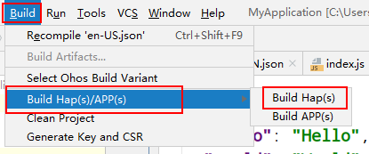

## 4. 基础开发说明


### 多语言支持

#### 定义资源文件

- 在 `src/main/ets/resources/`目录下，根据不同的语言定义不同的文件夹下面的 `string.json` 资源文件。
  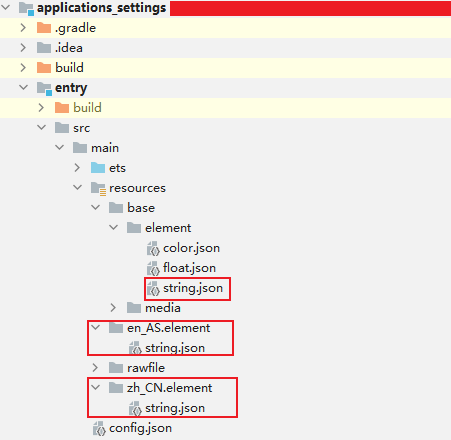

#### 引用资源

- 在对应ets文件中，可直接通过`$r()`引用。

  ```` 
  this.title = $r('app.string.world');
  this.icon = $r('app.media.icon');
  ````

## 5. 典型接口的使用

1. 读取json配置文件

```
  import fileio from '@ohos.fileio';

  readLocalFile(fileName): any[]{
    try {
      let stream = FileIo.createStreamSync(fileName, 'r');
      LogUtil.info('settings readLocalFile stream:' + stream);
      let buf = new ArrayBuffer(4096);
      let len = stream.readSync(buf);
      LogUtil.info('settings readLocalFile len:' + len);
      let arr = new Uint8Array(buf);
      let charAt = ' '.charCodeAt(0);
      for (let i = len;i < 4096; i++) {
        arr[i] = charAt;
      }
      let content = String.fromCharCode.apply(null, arr);
      stream.closeSync();
      LogUtil.info('settings readLocalFile content:' + JSON.stringify(content));
      return JSON.parse(content);
    } catch (jsonError) {
      LogUtil.info('settings readLocalFile jsonError:' + jsonError);
    }
  }
```


2. 查询所有应用信息

```
import Bundle from  '@ohos.bundle';

Bundle.getAllBundleInfo(0)
      .then((data) => {
      console.info('Settings getAllBundleInfo： '+JSON.stringify(data));
    }
  );
```

3. 获取wifi扫描信息

```
import wifi_native_js from '@ohos.wifi_native_js';

getScanInfos() {
   wifi_native_js.getScanInfos(result => {
        this.animator_on = false;
        var clen = Object.keys(result).length;
        console.log("[wifi_js_test] wifi received scan info call back: " + clen);
        for (var j = 0; j < clen; j++) {
            console.log("result[0].ssid :" + result[j].ssid);
            console.info("securityType: " + result[j].securityType);
            console.info("rssi: " + result[j].rssi);
            console.info("band: " + result[j].band);                          
        }      
	});
}
```

4. Preferences 存取数据

```
import storage from '@ohos.data.storage';
// 数据存放路径
const PREFERENCES_PATH = '/data/accounts/account_0/appdata/com.ohos.settings/sharedPreference/SettingsPreference';
let mPreferences = Storage.getStorageSync(PREFERENCES_PATH);

save(key,value) {
   mPreferences.putSync(key, value);
   mPreferences.flushSync();
}

get(key,defaultValue): any {
   return mPreferences.getSync(key, defaultValue); 
}
```


## 6. 签名打包

### 签名

#### 签名文件的获取

1. 拷贝 OpenHarmony 标准版的 prebuilts\signcenter 目录到操作目录
2. 拷贝Settings工程的 signature\settings.p7b 到该目录下

#### 签名文件的配置

打开项目工程，选择 File → Project Structure


选择 Modules → Signing Configs，将对应的签名文件配置如下，完成后点击Apply，再点击OK。


配置完成后，对应的build.gradle文件中会出现如下内容

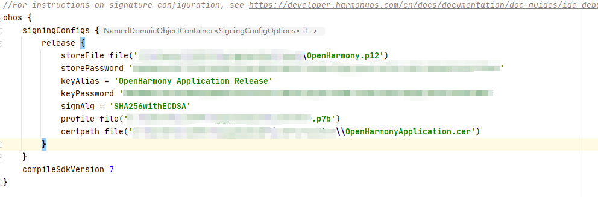

### 打包

DevEco Studio 支持 debug 与 release 两种打包类型。可以在 OhosBuild Variants 窗口中进行切换。

 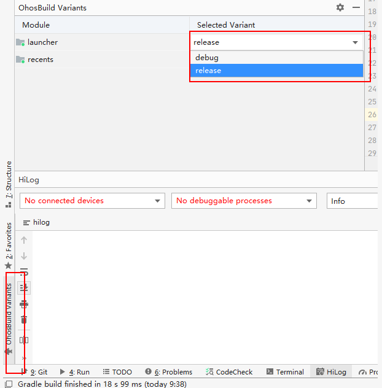

#### debug打包

1. 代码准备完成后，在 OhosBuild Variants 窗口的 Selected Variant 中选择 debug。   

   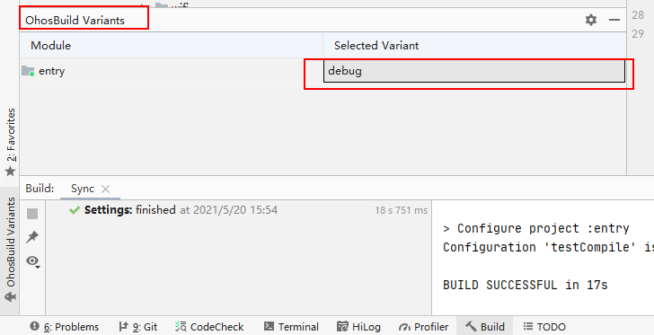

2. 选择Build → Build Haps(s)/APP(s) → Build Hap(s)

   

3. 编译完成后，hap包会生成在工程目录下的 `\build\outputs\hap\debug\phone\`路径下（如果没有配置签名，则只会生成未签名的hap包）

   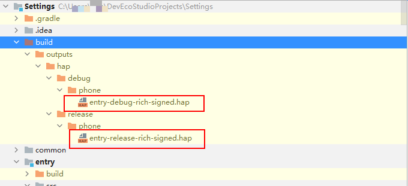

#### release打包

1. 代码准备完成后，在 OhosBuild Variants 窗口的 Selected Variant 中选择 release   

   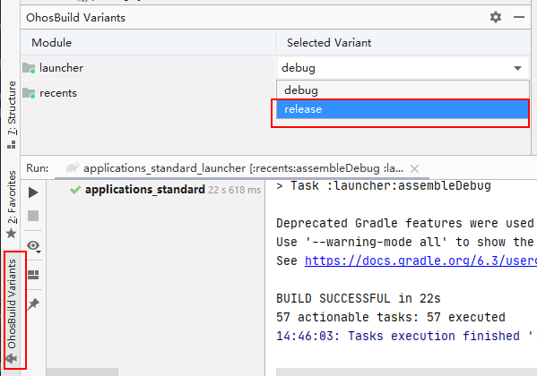

2. 选择Build → Build Haps(s)/APP(s) → Build Hap(s)

   

3. 编译完成后，hap包会生成在工程目录下的 `\build\outputs\hap\release\phone\`路径下（如果没有配置签名，则只会生成未签名的hap包）

   


## 7. 安装、运行、调试

## 应用安装

配置 hdc：
进入SDK目录中的toolchains文件夹下，获取文件路径：


> 注意，此处的hdc.exe如果版本较老，可能不能正常使用，需要获取新的hdc.exe文件

并将此路径配置到环境变量中：


重启电脑使环境变量生效

连接开发板，打开cmd命令窗口，执行hdc list targets，弹出窗口如下：


等待一段时间后，窗口出现如下打印，可回到输入 hdc list targets 的命令窗口继续操作:


再次输入hdc list targets，出现如下结果，说明hdc连接成功


获取 root 权限与读写权限：

```
hdc smode（当前版本可能仍不稳定，执行此命令可能导致后续的hdc target mount 失败，可不执行）
hdc target mount（效果与remount类似）
```

将签名好的 hap 包放入设备的 `/system/app` 目录下，并修改hap包的权限

```
hdc file send 本地hap包路径 /system/app/hap包名称
例如：hdc file send Settings.hap /system/app/Settings.hap
```

> 注意，如果设备不存在 `/system/app` 目录，则需要手动创建该目录并修改权限。
>
> ```
> hdc shell
> cd system
> mkdir app
> chmod 777 app
> ```
>
> `/system/app` 目录放置系统应用，例如：Launcher，SystemUI，Settings 等。
>
> 但hap包需要在该目录下手动设置权限
>
> ```
> chmod 666 hap包名
> ```
>
> 此目录应用不用手动安装，系统自动拉起。

## 应用运行

Settings 属于系统应用，在将签名的 hap 包放入 `/system/app` 目录后，重启系统，应用会自动拉起。

```
hdc shell reboot （不可以直接执行hdc reboot，命令是无效的)
```

> 注意，如果设备之前安装过系统应用，则需要执行如下两条命令清除设备中存储的应用信息，才能够在设备重启的时候将最新装入设备的新 hap 包正常拉起。
>
> ```
> hdc shell rm -rf /data/misc_de/0/mdds/0/default/bundle_manager_service
> hdc shell rm -rf /data/accounts
> ```

## 应用调试

#### log打印
- 在程序中添加 log
```
console.info("Setting log info");
```
#### log获取及过滤
- log获取

将log输出至文件  
```
hdc shell hilog > 输出文件名称
```

例：
在真实环境查看log，将全log输出到当前目录的hilog.log文件中

```
hdc shell hilog > hilog.log
```

- log过滤

在命令行窗口中过滤log
```
hilog | grep 过滤信息
```

例：过滤包含信息 Label 的 hilog
```
hilog | grep Label
```

## 8. 贡献代码

### Fork 代码仓库

1. 在码云上打开 Settings 代码仓库（[仓库地址](https://gitee.com/openharmony/applications_settings)）。
2. 点击仓库右上角的 Forked 按钮
   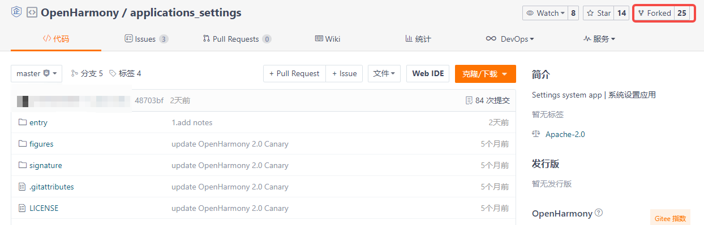
3. 在弹出的画面中，选择将仓库 fork 到哪里，点击确认。
   
4. Fork 成功之后，会在自己的账号下看见 fork 的代码仓库。
   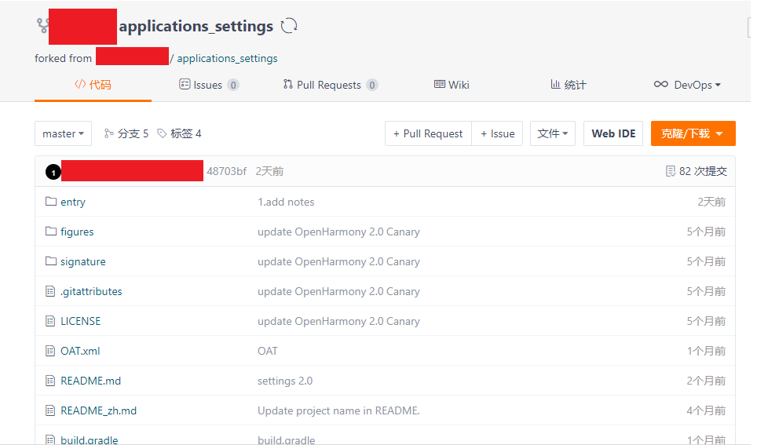

### 提交代码

1. 访问我们自己在码云账号上 fork 的代码仓库，点击“克隆/下载”按钮，选择 SSH，点击“复制”按钮。
   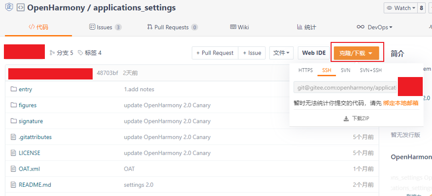

2. 在本地新建 Settings 目录，在 Settings 目录中执行如下命令

   ```
   git clone 步骤1中复制的地址
   ```

3. 修改代码。

   > 将代码引入工程，以及编译工程等相关内容请参见 **3. 代码使用** 部分的相关内容。

4. 提交代码到 fork 仓库。  

   > 修改后的代码，首先执行 `git add` 命令，然后执行 `git commit -s` 命令与 `git push` 命令，将代码 push 到我们自己的 fork 仓中。
   > 关于代码提交的这部分内容涉及 git 的使用，可以参照 [git官网](https://git-scm.com/) 的内容，在此不再赘述。

### 发起 Pull Request (PR)

在将代码提交到 fork 仓之后，我们可以通过发起 Pull Request（PR）的方式来为 OpenHarmony 的相关项目贡献代码。

1. 打开 fork 仓库。选择 `Pull Requests` → `新建 Pull Request`

   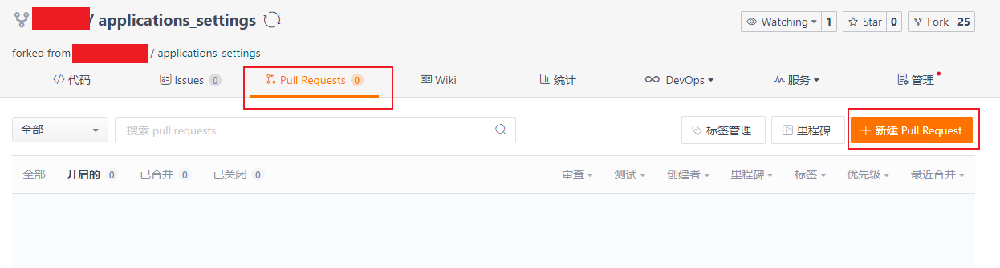

2. 在 `新建 Pull Request` 画面填入标题与说明，点击 `创建` 按钮。

   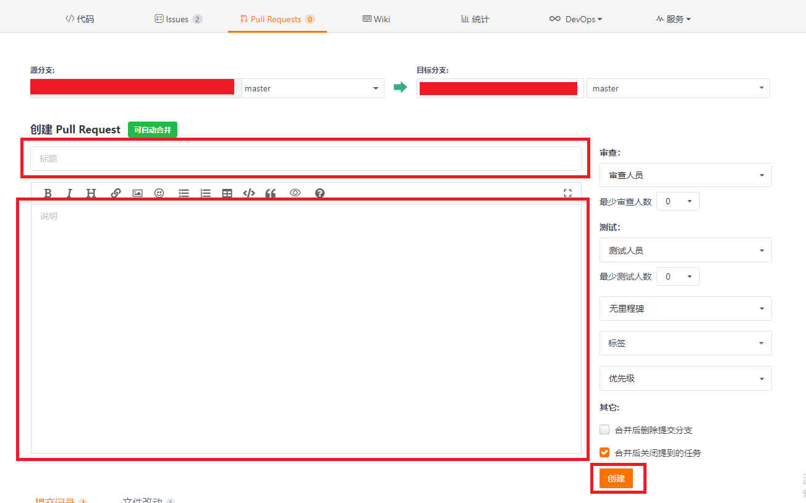

3. 创建 Pull Request 完成。 PR 创建完成后，会有专门的代码审查人员对代码进行评审，评审通过之后会合入相应的代码库。

   

系统应用

**applications\_settings**
