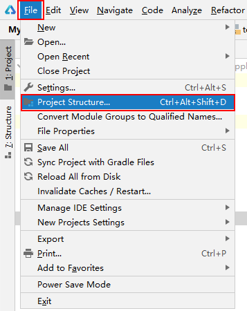
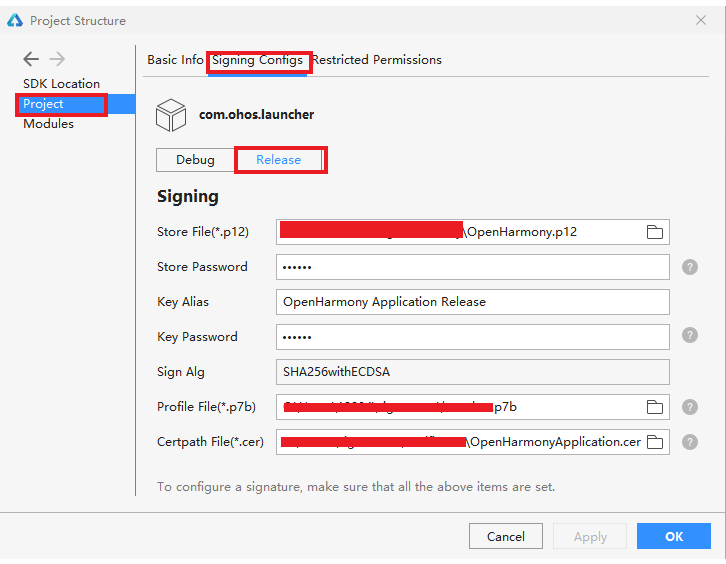
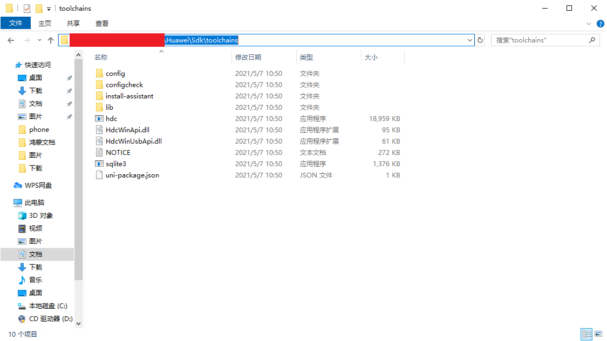
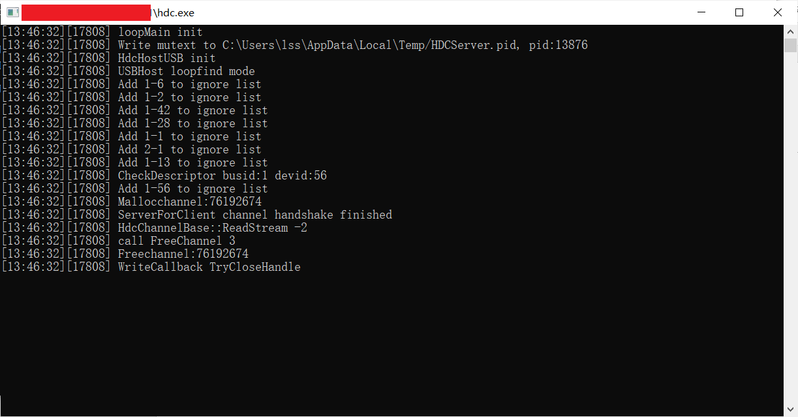
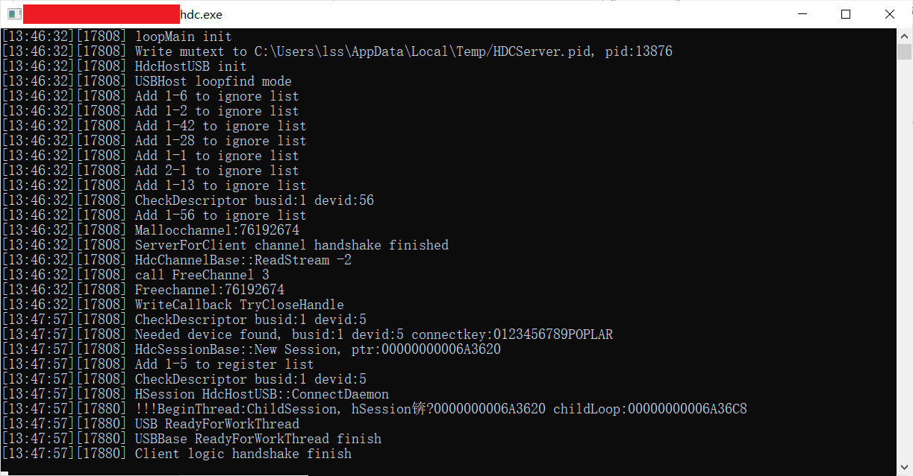
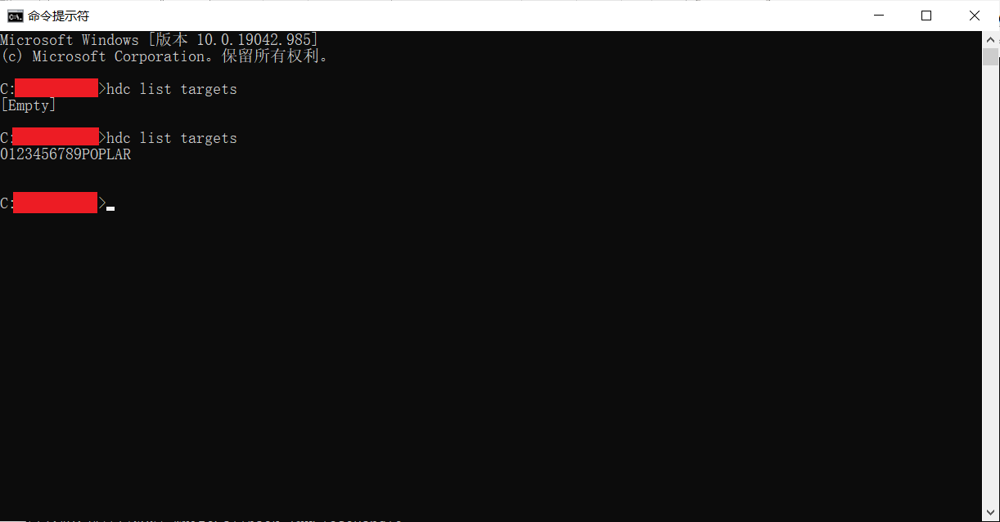

# Settings<a name="ZH-CN_TOPIC_0000001103421572"></a>

-   [简介](#section11660541593)
    -   [架构图](#section48896451454)

-   [目录](#section161941989596)
-   [使用说明](#section161941989598)
-   [相关仓](#section1371113476307)

## 简介<a name="section11660541593"></a>

设置应用是 OpenHarmony 系统中预置的系统应用，为用户提供设置系统属性的交互界面，例如设置系统时间，屏幕亮度等系统属性。

### 架构图<a name="section48896451454"></a>


## 目录<a name="section161941989596"></a>

```
/applications/standard/settings
├── entry             # 主entry模块目录
│   └── src
│       ├── main
│           ├── ets               # ets模块目录
│               ├── default
│                   ├── common    # 公共工具存放目录
│                   ├── model     # 数据管理和决策逻辑存放目录
│                   ├── pages     # 组件页面存放目录
│                   ├── res       # 部分图片资源
│                   ├── resources # 其它共用资源
│                   ├── app.ets   # 全局ets逻辑和应用生命周期管理文件
│           ├── resources         # 资源配置文件存放目录
│               ├── base          # 默认语言场景，图片资源，字体大小，颜色资源内容存放目录
│               ├── en_AS.element # 英文语言场景资源内容存放目录
│               ├── rawfile       # 本地配置文件存放目录
│               ├── zh_CN.element # 中文语言场景资源内容存放目录
│           └── config.json       # 全局配置文件
├── signature              # 证书文件目录
├── LICENSE                # 许可文件
```

## 使用说明<a name="section161941989598"></a>
### 代码下载
#### 配置码云ssh
1. 安装Git
2. 生成公钥，[参考链接](https://gitee.com/help/articles/4181#article-header0)
3. 在码云个人设置-安全设置-ssh公钥中配置公钥，[参考链接](https://gitee.com/help/articles/4191)


#### 下载代码
1. 打开码云Settings地址，[下载地址](https://gitee.com/openharmony/applications_settings)
2. 选择克隆/下载 - https方式 -复制下载地址
3. 本机git bash 中执行：
 ```
 git clone 'https://gitee.com/openharmony/applications_settings.git'
 ```

### 环境搭建
1. 安装DevEco Studio
2. 按照操作配置DevEco Studio
3. 替换full-SDK,[参考链接](https://docs.openharmony.cn/pages/v4.1/zh-cn/application-dev/faqs/full-sdk-switch-guide.md)


### 系统接口调用
#### NAPI接口集成
- 导入指定模块
``` JavaScript
import bundle from '@ohos.bundle';
```
- 调用模块中的相应函数
``` JavaScript
bundle.getApplicationInfos().then(data => {

});
```
### 异步回调的使用
- 在需要回调操作的ets文件中创建回调函数
```JavaScript
subscribeCallback(err, data){
    // do something
},
```
- 调用应用内部封装的接口，并传入回调函数
```JavaScript
Notification.subscribe(mSubscriber, this.subscribeCallback.bind(this));
```
- 在AsyncCallback返回数据时可以获取到错误信息或目标数据
```JavaScript
subscribeCallback(err, data) {
    Log.showInfo(TAG, 'subscribeCallback finished ====================' + JSON.stringify(data));
}
```
### 如何引用资源文件
- 在.ets文件中，可直接通过$r()引用资源
```` JavaScript
this.title = this.$r('app.string.hello_world');
````

### 签名
#### 签名文件的获取
1. 拷贝OpenHarmony标准版 工程的 OpenHarmony\signcenter_tool 目录到操作目录
2. 拷贝Settings 工程的 signature\settings.p7b 到该目录下
#### 签名文件的配置
打开项目工程，选择 File → Project Structure



选择 Project → Signing Configs，将对应的签名文件配置如下，完成后点击Apply，再点击OK。



### 应用安装
配置 hdc：
进入SDK目录中的toolchains文件夹下，获取文件路径：



> 注意，此处的hdc.exe如果版本较老，可能不能正常使用，需要获取新的hdc.exe文件  
> hdc命令介绍与下载详见：[hdc仓库地址](https://gitee.com/openharmony/developtools_hdc_standard)


并将此路径配置到环境变量中：


重启电脑使环境变量生效

连接开发板，打开cmd命令窗口，执行hdc list targets，弹出窗口如下：



等待一段时间后，窗口出现如下打印，可回到输入 hdc list targets 的命令窗口继续操作:



再次输入hdc list targets，出现如下结果，说明hdc连接成功



获取读写权限：

```
hdc target mount 
```
将签名好的 hap 包放入设备的 `/system/app/com.ohos.settings` 目录下，并修改hap包的权限

```
hdc file send 本地路径 /system/app/com.ohos.settings/hap包名称
例如：hdc file send Phone-default-signed.hap /system/app/com.ohos.settings/Settings.hap
```
### 应用运行
Settings属于系统应用，在将签名的 hap 包放入 `/system/app/com.ohos.settings` 目录后，重启系统，应用会自动拉起。
```
hdc shell
reboot
（不可以直接执行hdc reboot，命令是无效的)
```
> 注意，如果设备之前安装过系统应用，则需要执行如下两条命令以清除设备中存储的应用信息，确保在设备重启时能正常加载新安装的hap包。
> ```
> hdc  shell rm -rf  /data/misc_de/0/mdds/0/default/bundle_manager_service
> hdc  shell rm -rf  /data/accounts
> ```
> 请确保在执行上述命令前，设备已备份重要数据，避免数据丢失。
### 应用调试
### log打印
- 在程序中添加 log
```JS
import hilog from '@ohos.hilog';
hilog.info(0x0001, "Settings", "%{public}s World %{private}d", "hello", 3);
```
### log获取及过滤
- log获取


将log输出至文件
```
hdc shell hilog > 输出文件名称
```

例：
在真实环境查看log，将全log输出到当前目录的hilog.log文件中
```
hdc shell hilog > hilog.log
```

- log过滤

在命令行窗口中过滤log
```
hilog │ grep 过滤信息
```

例：过滤包含信息 Label 的 hilog
```
hilog │ grep Label
```
### 贡献代码
### Fork 代码仓库
1. 在码云上打开 Settings 代码仓库（[仓库地址](https://gitee.com/openharmony/applications_settings)）。

2. 点击仓库右上角的 Forked 按钮，在弹出的画面中，选择将仓库 fork 到哪里，点击确认。

3. Fork 成功之后，会在自己的账号下看见 fork 的代码仓库。

### 提交代码
1. 在码云上访问我们分支的代码仓库，找到“克隆/下载”按钮，选择SSH或HTTPS协议，执行仓库的克隆操作。

2. 在本地新建 Settings 目录，在 Settings 目录中执行如下命令
   ```
   git clone 'https://gitee.com/openharmony/applications_settings.git'
   ```

3. 修改代码。

   > 将代码引入工程，以及编译工程等相关内容请参见 **3. 代码使用** 部分的相关内容。
4. 提交代码到 fork 仓库。
   > 修改后的代码，首先运行 `git add` 命令，接着执行 `git commit` 命令和 `git push` 命令，将代码提交至我们自己的 fork 仓库。
   > 关于代码提交的这部分内容涉及 git 的使用，可以参照 [git官网](https://git-scm.com/) 的内容，在此不再赘述。

### 发起 Pull Request (PR)
在将代码提交到 fork 仓库之后，我们可以通过发起合并请求（Pull Request）的方式来为 OpenHarmony 的相关项目贡献代码。

1. 打开 fork 仓库。选择 `Pull Requests` → `新建 Pull Request`

2. 在 `新建 Pull Request` 画面填入标题与说明，点击 `创建` 按钮。

3. 创建 Pull Request 完成。 PR 创建完成后，会有专门的代码审查人员对代码进行评审，评审通过之后会合入相应的代码库。

## 相关仓<a name="section1371113476307"></a>

系统应用
[applications_settings](https://gitee.com/openharmony/applications_settings.git/)


