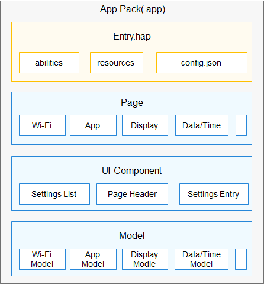

# Settings<a name="ZH-CN_TOPIC_0000001103421572"></a>

-   [简介](#section11660541593)
    -   [架构图](#section48896451454)

-   [目录](#section161941989596)
-   [相关仓](#section1371113476307)

## 简介<a name="section11660541593"></a>

设置应用是OpenHarmony系统中预置的系统应用，为用户提供设置系统属性的交互界面，例如设置系统时间，屏幕亮度等系统属性。

### 架构图<a name="section48896451454"></a>



## 目录<a name="section161941989596"></a>

```
/applications/standard/settings
├── figures                # 架构图目录
├── entry                  # 主entry模块目录
│    ├── src
│      ├── main
│        └── js            # js代码目录
│        └── resources     # 资源存放目录
│        └── config.json   # 全局配置文件
├── signature              # 证书文件目录
├── LICENSE                # 许可文件
```

## 相关仓<a name="section1371113476307"></a>

系统应用

**applications\_settings**

